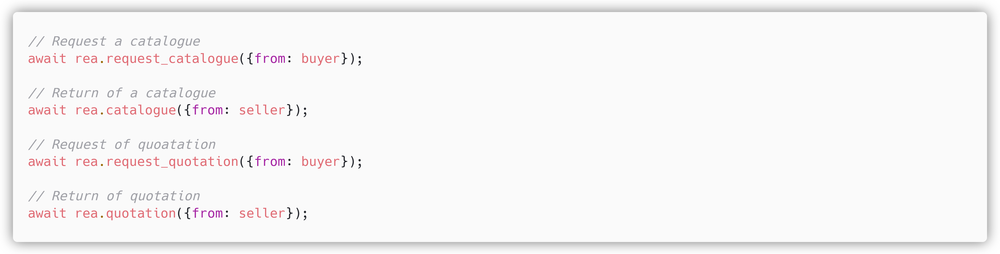
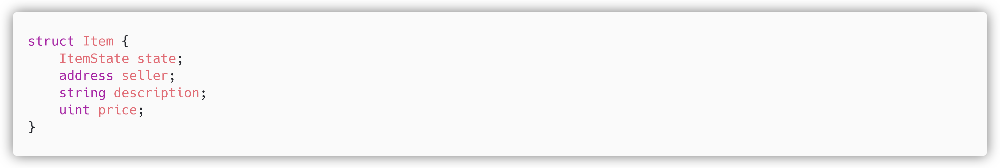
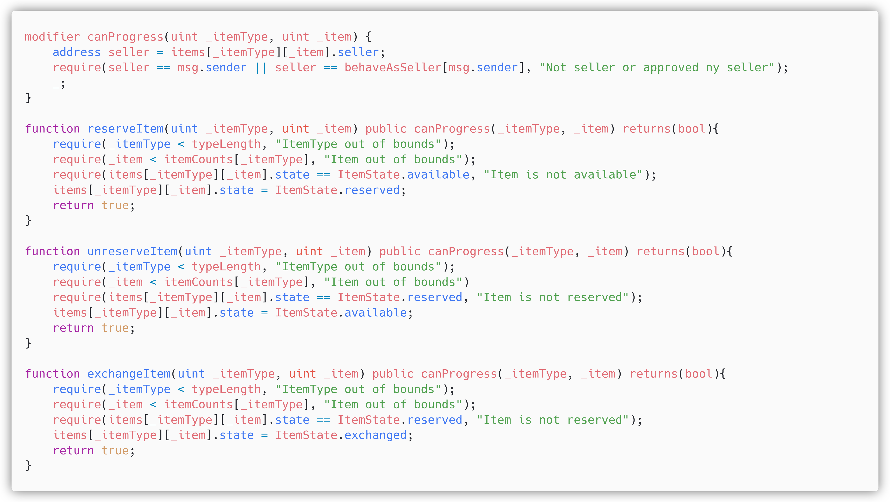
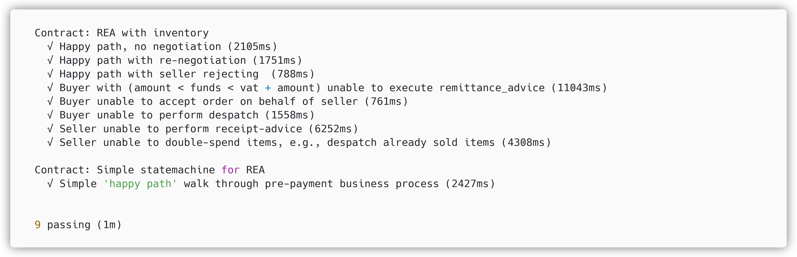
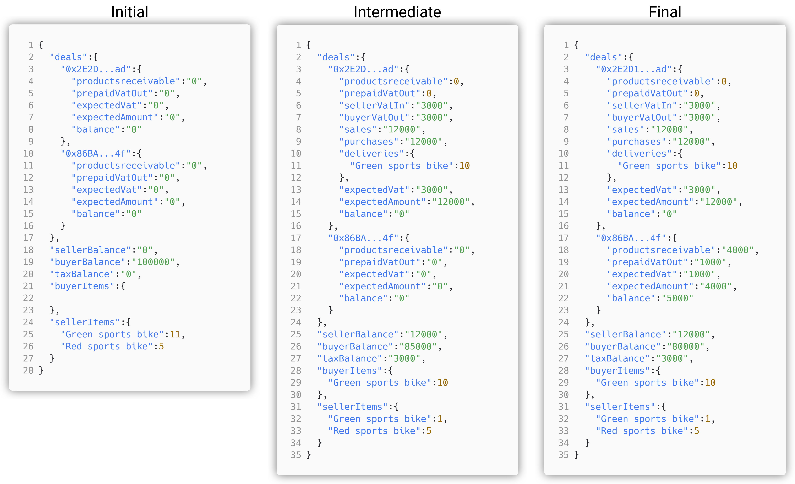

# Solidity code for REA smart contracts

Here we will briefly showcase some snippets from the smart contracts, and how to run the tests. 

## State machine only

The test `REA_paper_test.js` will progress the state of the contract without enforcing logic beyond validating the current state and the stimuli provided. This means that it is as said earlier, *ONLY* good for showing that we can progress properly through the state machine. 
It is fairly easy to read with an outline close to the following:



## State machine with logic and items

Hence the 'real' implementation of REA would require items such that we cannot double-spend goods that are to be transferred, i.e., bikes or similar, we have created an inventory contract. The inventory is to keep track of the goods, e.g., their state, who is the seller etc.  We store this in a structure `Item` that is written to the Ethereum blockchain, i.e., part of global knowledge. This means that everybody knows the properties of the item, which means that the blockchain can easily enforce rules on the progression of its state.



With the item as above, we can specify that only the seller, or someone approved by the seller may progress the state from available to unavailable. Further, as we can specify all the transitions in the inventory contract, we can ensure that it is not possible to change the state of an already sold item, meaning that if not the item is available the transaction will revert, e.g., be rejected. 



The seller can then allow the REA-contract between him and the buyer to progress the state of his items.  

Further, because the logic and items are now enforced within the smart contract, it can compute vat and enforce its payment. The full code for the inventory, and the REA contract that enforces it is visible in `Inventory.sol` and `REA_paper_inv.sol`. 

## How to run tests

The scenarios/tests can be run by utilsing the `truffle` testing suite. Simply run:

```shell
truffle test
```

The result will the be similar to the below, with different timings.



# Materialization

To get the materialization as seen below, run the `REA_test_materializer_complete.js` test with truffle.

